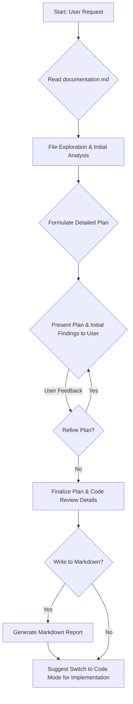

# BricksLift A/B Testing: Code Review & Dashboard Enhancement Plan

**Date:** May 20, 2025

## Introduction

This document outlines the plan for a comprehensive code review of the "BricksLift A/B Testing" WordPress plugin and the enhancement of its React-based admin dashboard for viewing A/B test statistics.

## Overall Process



## Part 1: Comprehensive Code Review & Problem Identification (Request 1)

The codebase will be systematically reviewed, focusing on the following areas. For each identified issue, the review will provide:
*   A clear description of the problem.
*   The specific file(s) and line number(s) where the issue is located.
*   A detailed explanation of why it's an issue.
*   A concrete code suggestion or a clear strategy for fixing it.

### 1.1. Security Vulnerabilities

*   **AJAX/REST Endpoints:**
    *   Verify nonce usage and effectiveness in `src/Frontend/Ajax_Handler.php` (e.g., `blft_frontend_nonce`, `blft_track_view_nonce`).
    *   Assess permission checks in REST endpoints like `src/API/Endpoints/Stats_Endpoint.php` (`manage_options`) and `src/API/Endpoints/Tests_Endpoint.php`. Ensure they are appropriate and sufficient.
*   **Data Sanitization/Escaping:**
    *   Review `$_POST` data handling in `src/Frontend/Ajax_Handler.php` for proper sanitization.
    *   Check meta field registration in `src/Core/CPT_Manager.php` for correct `sanitize_callback` usage.
    *   Examine data insertion and retrieval in `src/Core/DB_Manager.php`, ensuring consistent use of `$wpdb->prepare` and appropriate sanitization/escaping.
*   **Capability Checks:** Ensure `current_user_can()` is used correctly and with the least privilege necessary.
*   **General Vulnerabilities:** Look for potential XSS, CSRF risks.

### 1.2. Performance Bottlenecks

*   **Database Queries:**
    *   In `src/Core/DB_Manager.php`, review the efficiency of queries in `aggregate_daily_tracking_data()`, `get_aggregated_stats()`, `get_total_conversions_for_variant()`, and `get_total_views_for_variant()`.
*   **Frontend JavaScript (`frontend/js/blft-main.js`):**
    *   Analyze the impact of the dual AJAX calls (`trackImpression` and `sendTrackViewRequest`) made when a variant is displayed.
    *   Assess DOM manipulation efficiency and `localStorage`/`sessionStorage` use.
*   **PHP Code:**
    *   Review loops in `src/Core/Plugin.php` (e.g., `check_and_terminate_tests()`) and `src/Core/DB_Manager.php` (aggregation loop) for potential inefficiencies.
    *   Consider the performance of the cron job `perform_daily_stats_aggregation()`.

### 1.3. Code Quality & Best Practices

*   **WordPress Coding Standards:** General review for adherence.
*   **WordPress APIs & Hooks:** Verify correct and optimal use.
*   **Clarity, Readability, Maintainability:** Assess code organization, class design, comments, naming conventions.
*   **Error Handling:** Check for consistent and user-friendly error handling.
*   **Internationalization (i18n) & Localization (l10n):** Ensure all user-facing strings are correctly internationalized.
*   **Bricks Builder API Integration (`src/Integrations/Bricks/Element_Test_Wrapper.php`):** Focus on variant ID mapping.
*   **PHP Autoloading:** Clarify `require_once` in `src/Core/Plugin.php` vs. Composer PSR-4 autoloading.

### 1.4. Bug Detection

*   **Logical Errors:**
    *   Investigate dual data recording strategy for views (direct update to `blft_stats_aggregated` vs. logging to `blft_tracking` for cron).
    *   Confirm why `Ajax_Handler::handle_track_conversion` appears unused by `frontend/js/blft-main.js`.
    *   Address discrepancies in meta keys for test duration/termination.
    *   Harmonize test status checking (`post_status` vs. `_blft_status`).
*   **Race Conditions:** Consider potential race conditions with cron job and direct DB updates.
*   **Edge Cases:**
    *   Review GDPR consent logic in `frontend/js/blft-main.js`.
    *   Examine variant selection fallback logic.
*   **A/B Variant Selection & Persistence:**
    *   Ensure variant selection in `frontend/js/blft-main.js` connects to actual CPT variant configurations.
    *   Verify robustness of `localStorage` for variant stickiness.
    *   Address variant ID mapping between `Element_Test_Wrapper.php` and `_blft_variants` meta.
    *   Handle consistency of variant count (Bricks children vs. CPT variants).

### 1.5. Architectural Soundness

*   **File/Folder Organization:** Review against `documentation.md`.
*   **Class Design:** Review singleton usage and manager class responsibilities.
*   **Data Flow:** Focus on the tracking data flow for impressions and conversions.
*   **Scalability:** Assess database schema and query patterns for large datasets.

## Part 2: Enhance and Finalize the A/B Testing Dashboard (Request 2)

### 2.1. New/Enhanced REST API Endpoint for Daily Stats

*   **Necessity:** Current `Stats_Endpoint.php` provides totals, not daily breakdown for trends.
*   **Proposal:** Create `GET blft/v1/test-stats-daily/<test_id>`.
    *   **Parameters:** `test_id` (required), `start_date` (optional, YYYY-MM-DD), `end_date` (optional, YYYY-MM-DD).
    *   **Functionality:** Query `blft_stats_aggregated`, group by `stat_date` and `variant_id`.
    *   **Response Structure (Example):**
        ```json
        [
          {
            "date": "2025-05-19",
            "variants": [
              { "variant_id": "var_uuid1", "variant_name": "Variant A", "impressions": 150, "conversions": 10 },
              { "variant_id": "var_uuid2", "variant_name": "Variant B", "impressions": 145, "conversions": 12 }
            ]
          },
          {
            "date": "2025-05-20",
            "variants": [
              { "variant_id": "var_uuid1", "variant_name": "Variant A", "impressions": 160, "conversions": 11 },
              { "variant_id": "var_uuid2", "variant_name": "Variant B", "impressions": 155, "conversions": 15 }
            ]
          }
        ]
        ```

### 2.2. React Component Structure for Individual Test Dashboard

*   **Navigation:**
    *   Add "View Stats" button in `admin-ui/src/components/Dashboard/Dashboard.js`.
    *   In `admin-ui/src/App.js`, add a new view state (e.g., `testStatsDetail`) and navigation handler.
*   **New Main Component: `TestStatsDashboard.js`**
    *   Receives `testId` prop.
    *   Fetches data from new daily stats endpoint and general test info from `blft/v1/tests/<test_id>`.
    *   Manages loading/error states.
    *   Processes data and renders sub-components.
*   **Sub-Components:**
    *   **`KeyMetricsDisplay.js`:** Cards/summary table for total impressions, conversions, CR, lift per variant.
    *   **`ConversionTrendChart.js`:** Line chart for daily CR trend per variant (using `@wordpress/charts` or Chart.js).
    *   **`DailyStatsTable.js`:** Table for daily impressions, conversions, CR per variant.
    *   **`WinnerHighlight.js`:** Highlights variant with highest CR; includes low data volume disclaimer.
    *   **`TestInformation.js`:** Displays test status, dates, goal description.

### 2.3. Metric Calculations & Data Handling

*   **Conversion Rate (CR):** `(Conversions / Impressions) * 100%`. Handle zero impressions.
*   **Lift Percentage:** `((VariantCR - AverageCR_Of_Other_Variants) / AverageCR_Of_Other_Variants) * 100%` (for now).
*   **Chart Data Preparation:** Transform API data for charting library.
*   **Low Data Volume Check:** Define threshold (e.g., 100 impressions/variant) for disclaimer.

### 2.4. User Interface & Experience

*   Utilize `@wordpress/components` for consistency.
*   Ensure clean, intuitive, and responsive design.

### Proposed Dashboard Architecture Diagram

```mermaid
graph TD
    A[App.js (Router)] -- Navigates to --> B(TestStatsDashboard.js);
    B -- Receives testId --> B;
    B -- Fetches general test info --> C["/blft/v1/tests/:test_id"];
    B -- Fetches daily stats --> D["New: /blft/v1/test-stats-daily/:test_id"];
    D -- Gets data from --> E["DB_Manager (new method for daily stats)"];
    E -- Queries --> F["blft_stats_aggregated table"];
    B -- Passes data to --> G[KeyMetricsDisplay.js];
    B -- Passes data to --> H[ConversionTrendChart.js];
    B -- Passes data to --> I[DailyStatsTable.js];
    B -- Passes data to --> J[WinnerHighlight.js];
    B -- Passes data to --> K[TestInformation.js];

    L[MainDashboard.js] -- "View Stats" Click --> A;
```

## Next Steps

1.  **User Approval:** This plan has been approved.
2.  **Implementation:** Switch to "Code" mode to implement the suggested code review fixes and develop the new dashboard features.