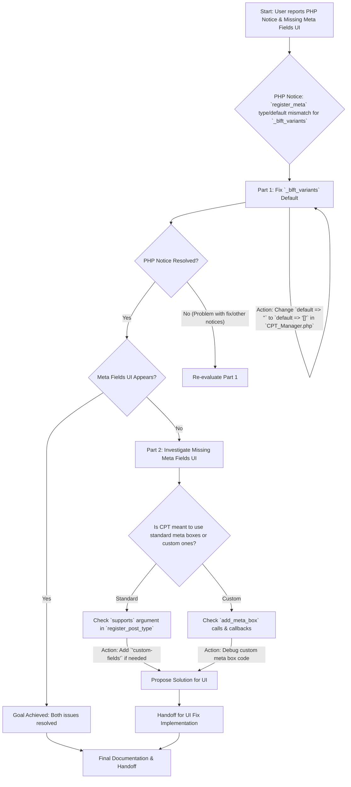

# Debugging Plan: `register_meta` Notice and Missing CPT Meta Fields UI

This document outlines the plan to address two related issues in the BricksLift A/B Testing plugin:
1.  A PHP Notice: `Function register_meta was called incorrectly. When registering a default meta value the data must match the type provided.`
2.  Custom meta fields not appearing on the "Edit Test" screen for the `blft_test` Custom Post Type (CPT).

## Part 1: Address the `register_meta` PHP Notice (Primary Goal)

### Problem Identification
The PHP notice is believed to originate from the meta field registration for `_blft_variants` within the `register_meta_fields` method in `src/Core/CPT_Manager.php`.

*   **File:** [`src/Core/CPT_Manager.php`](src/Core/CPT_Manager.php)
*   **Relevant Code Block (Lines 141-160):**
    ```php
    register_post_meta(
        self::CPT_SLUG,
        '_blft_variants',
        [
            'type'              => 'string', // Stored as JSON string
            'description'       => __( 'JSON array of test variants: [{"id": "uuid", "name": "Variant Name", "distribution": 50}]', 'brickslift-ab-testing' ),
            'single'            => true,
            'show_in_rest'      => [
                'schema' => [
                    'type'  => 'array', // REST schema type is 'array'
                    'items' => [
                        'type'       => 'object',
                        'properties' => [
                            'id'           => [ 'type' => 'string' ],
                            'name'         => [ 'type' => 'string' ],
                            'distribution' => [ 'type' => 'integer' ],
                        ],
                    ],
                ],
            ],
            'default'           => '', // Default is an empty string
        ]
    );
    ```
*   **The Issue:**
    *   The meta field is registered with `type => 'string'` and `default => ''` (see lines 143 and 159).
    *   However, the `show_in_rest` schema (used by the WordPress REST API) defines this field's `type` as `'array'` (see line 148).
    *   When WordPress processes this for the REST API, it encounters a conflict: the registered default is an empty string (`''`), but the REST API schema expects an array. An empty string is not a valid default for an `array` type (which should typically default to `[]` or a valid JSON string representing an empty array). This mismatch is the most probable cause of the PHP notice.

### Proposed Solution
Modify the `default` value for `_blft_variants` in `src/Core/CPT_Manager.php` to be a valid JSON string representation of an empty array.

*   **File:** [`src/Core/CPT_Manager.php`](src/Core/CPT_Manager.php)
*   **Line:** 159
*   **Current Code:** `'default'           => '',`
*   **Proposed Change:** `'default'           => '[]',`
*   **Reasoning:** This change ensures that the default value, while still a string (as per `type => 'string'`), is a *valid JSON representation of an empty array*. This aligns with the `type => 'array'` defined in the `show_in_rest` schema.

### Expected Outcome for Part 1
The PHP notices related to `register_meta` (specifically "When registering a default meta value the data must match the type provided") should no longer appear in the PHP error logs.

## Part 2: Address Missing Meta Fields on CPT Edit Screen (Secondary Goal)

This part is contingent on the successful resolution of Part 1. It's hypothesized that the PHP notice might be preventing the meta fields from being correctly set up for the admin UI.

### Verification After Part 1 Fix
Once the change from Part 1 is implemented and confirmed to resolve the PHP notice:
1.  Navigate to the "Edit Test" screen for any `blft_test` CPT instance.
2.  Check if the custom meta fields (e.g., Description, Variants, Goal Type, etc.) are now visible and editable.

### If Meta Fields Are Still Missing
If the meta fields do not appear even after the Part 1 fix, further investigation will be required:

1.  **Check CPT `supports` Argument:**
    *   **File:** [`src/Core/CPT_Manager.php`](src/Core/CPT_Manager.php)
    *   **Relevant Code (Line 70):** ` 'supports'            => [ 'title' ],`
    *   **Issue:** For WordPress to automatically display its standard meta box UI (including custom fields registered via `register_post_meta`), the CPT must declare support for `'custom-fields'`.
    *   **Proposed Action (if needed):** Modify the `supports` array to include `'custom-fields'`:
        `'supports'            => [ 'title', 'custom-fields' ],`

2.  **Investigate Custom Meta Box Code (if applicable):**
    *   If the plugin is designed to use its own custom-coded meta boxes (rather than relying on the default WordPress UI for custom fields), then the issue might lie in:
        *   The `add_meta_box()` function calls (incorrect parameters, wrong hook, etc.).
        *   The callback functions responsible for rendering the HTML for these custom meta boxes.
    *   **Proposed Action (if needed):** Debug the relevant `add_meta_box` calls and their associated rendering callback functions.

### Expected Outcome for Part 2
The custom meta fields for the `blft_test` CPT will be visible and functional on the "Edit Test" screen in the WordPress admin area.

## Overall Plan Visualization



## Next Steps
1.  Implement the proposed change in Part 1.
2.  Verify if the PHP notice is resolved.
3.  Verify if the meta fields UI is now appearing on the CPT edit screen.
4.  If the UI is still missing, proceed with the investigation steps outlined in Part 2.
5.  Switch to a "Code" or "Debug" mode for implementation.